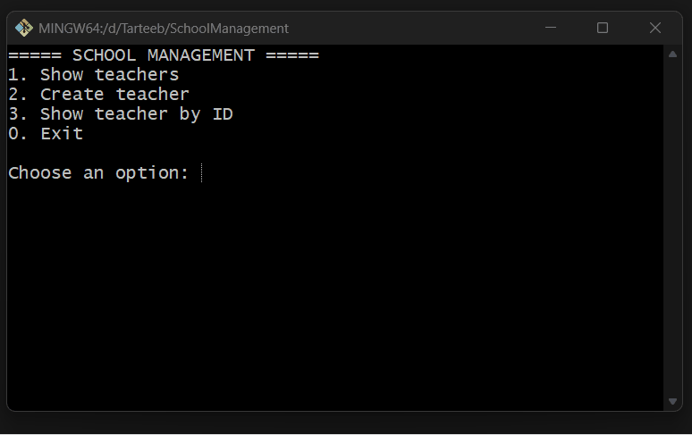

# School Management

C# console ilovasi — o'qituvchilar (teachers) ma'lumotlarini boshqarish uchun oddiy CRUD dastur. OOP prinsiplari va Service pattern asosida yozilgan.

## Imkoniyatlar

- ➕ Yangi o'qituvchi qo'shish
- 📋 Barcha o'qituvchilar ro'yxatini ko'rish
- 🔍 ID bo'yicha o'qituvchini topish

## Loyiha tuzilishi

```
SchoolManagement/
├── Models/
│   └── Teachers/
│       └── Teacher.cs           # Teacher modeli
├── Services/
│   └── Teachers/
│       ├── ITeacherService.cs   # Service interface
│       └── TeacherService.cs    # Service implementatsiyasi
├── App.cs                       # UI va menu logikasi
└── Program.cs                   # Entry point
```

## DEMO



## Muallif

Izzatjon Qodirov

---

*Bu loyiha o'qish va amaliyot maqsadida yozilgan.*